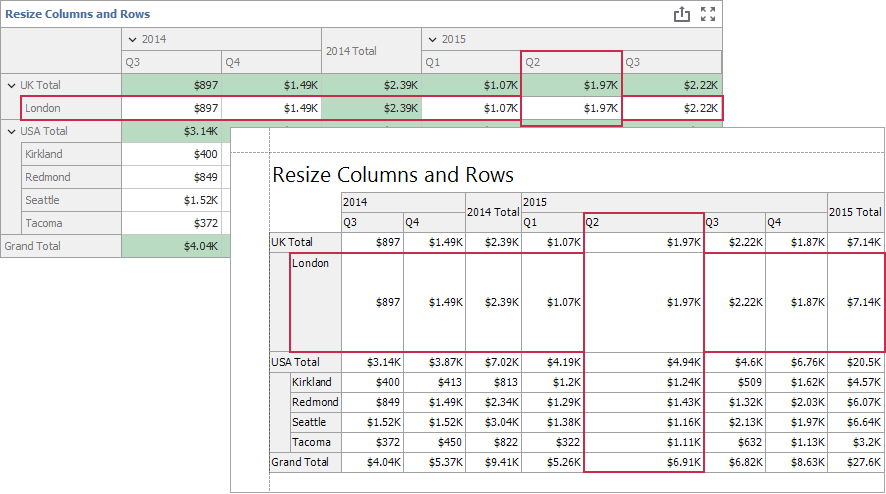

<!-- default badges list -->

<!-- default badges end -->

# Dashboard for WinForms - How to Export the Customized Pivot Grid Item

The example shows how to customize the Pivot Grid dashboard item in the exported document when you handle the `DashboardDesigner.CustomExport` event.  

## Example Overview

This example contains several Pivot Grid items with different customization settings. The `e.GetPrintableControl` obtains the `XRPivotGrid` printable controls, and allows you to apply different customization settings for each item. 

### Example Overview

#### Remove Specified Columns and Rows 

The [CustomFieldValueCells](https://docs.devexpress.com/XtraReports/DevExpress.XtraReports.UI.XRPivotGrid.CustomFieldValueCells) event removes the "Kirkland" row and "1" and "3" quarter columns by names in the `PivotCustomFieldValueCells` event handler. 

#### Rename Columns 

The [FieldValueDisplayText](https://docs.devexpress.com/XtraReports/DevExpress.XtraReports.UI.XRPivotGrid.FieldValueDisplayText) event changes the display text in the quarter columns of the `OrderDate` field in the `PivotFieldValueDisplayText` event handler.

#### Remove Rows by Value

The [CustomFieldValueCells](https://docs.devexpress.com/XtraReports/DevExpress.XtraReports.UI.XRPivotGrid.CustomFieldValueCells) event removes all rows whose grand total value is less than 200 in the `PivotCustomFieldValueCellsVals` event handler.

#### Resize Columns and Rows

The [CustomColumnWidth](https://docs.devexpress.com/XtraReports/DevExpress.XtraReports.UI.XRPivotGrid.CustomColumnWidth) event sets the width of the "2" quarter column in the exported document in the `PivotCustomColumnWidth` event handler. 
The [CustomRowHeight](https://docs.devexpress.com/XtraReports/DevExpress.XtraReports.UI.XRPivotGrid.CustomRowHeight) event sets the height of the "London" row in the exported document in the `PivotCustomRowHeight` event handler.

#### Change Row Appearance 

The [PrintFieldValue](https://docs.devexpress.com/XtraReports/DevExpress.XtraReports.UI.XRPivotGrid.PrintFieldValue) event customizes the appearance of the "Seattle" row in the `PivotPrintFieldValue` event handler.

#### Customize Grand Totals 

The [CustomFieldValueCells](https://docs.devexpress.com/XtraReports/DevExpress.XtraReports.UI.XRPivotGrid.CustomFieldValueCells) event changes the Grand Total column position to `near` in the `PivotCustomFieldValueCellsResults` event handler. The [ShowRowGrandTotals](https://docs.devexpress.com/CoreLibraries/DevExpress.XtraPivotGrid.PivotGridOptionsViewBase.ShowRowGrandTotals) property that is set to `false` hides the Grand Total row.

## Files to Review

- [Program.cs](./CS/WinFormsExport/Program.cs) ([Program.vb](./VB/WinFormsExport/Program.vb))
- [Form1.cs](./CS/WinFormsExport/Form1.cs) ([Form1.vb](./VB/WinFormsExport/Form1.vb))

## Documentation

- [Custom Export](https://docs.devexpress.com/Dashboard/15187/winforms-dashboard/winforms-designer/printing-and-exporting?p=netframework#custom-export)
- [XRPivotGrid](https://docs.devexpress.com/XtraReports/DevExpress.XtraReports.UI.XRPivotGrid._members)

## More Examples

- [Dashboard for WinForms - How to Export Customized Pie Dashboard Item](https://github.com/DevExpress-Examples/WinForms-Dashboard-How-to-export-customized-Pie-Dashboard-Item)
- [Dashboard for WinForms - How to Display Custom Information in the Exported Dashboard](https://github.com/DevExpress-Examples/winforms-dashboard-how-to-add-custom-information-to-the-exported-dashboard-t466558)
